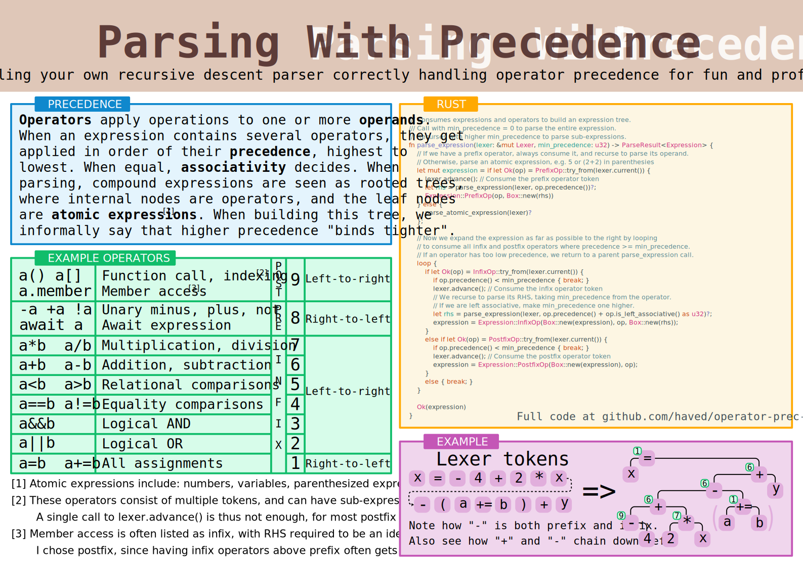

# Operator precedence parsing poster
I wanted to make a poster showing how compound expressions, i.e. expressions with operators,
can be parsed in a recursive descent style parser. It supports both infix, prefix and
postfix operators, and nicely handles both left- and right-associative operators.



Convincing oneself that the algoritgm is correct is a nice exercise in recursive thinking.
The poster itself does not include the complete source code of a parser,
but hopefully enough to understand the algorithm.

A complete program that can do simple arithmetic is included in this repo, run using
``` sh
cargo run
```

## Poster details
Designed in Inkscape, intended to be printed in A3 format.
The output pdf is slightly bigger, to make room for crop and bleed marks.

The CMYK pdf, for printing, is generated using the `cmyk_convert.sh` script,
which does change the colors a bit, but I think they still look nice.

The poster is exclusivly vector graphics,
and uses the Inconsolata font for most text.
The footnotes are non-monospace, the code is the "Hack" font.
Syntax highlighting is done by hand, but based on the theme "Solarized (light)" from [carbon](carbon.now.sh).
