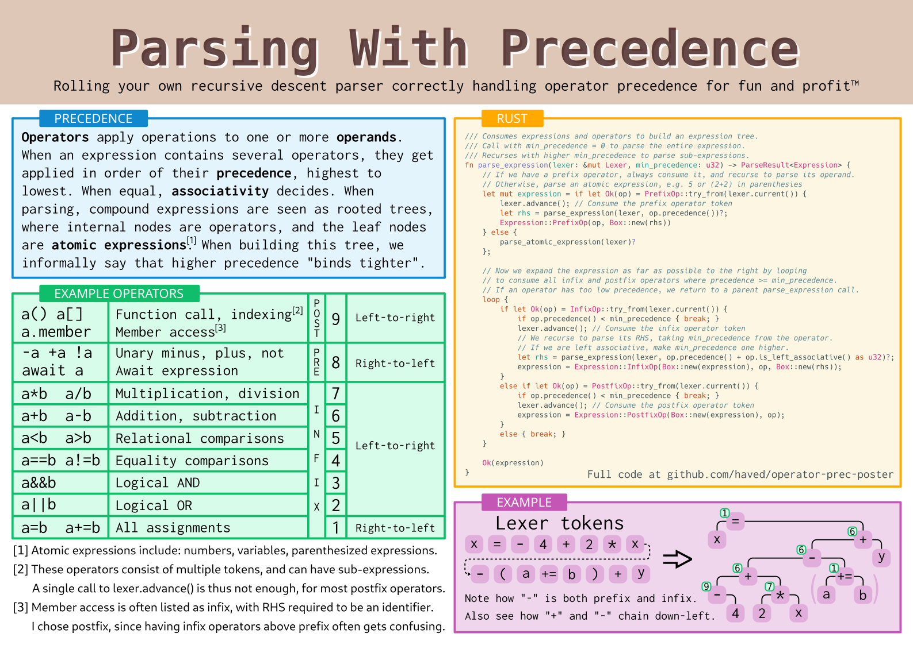

# Operator precedence parsing poster
I wanted to make a poster showing how compound expressions, i.e. expressions with operators,
can be parsed in a recursive descent style parser. It supports both infix, prefix and
postfix operators, and nicely handles both left- and right-associative operators.



Convincing oneself that the algoritgm is correct is a nice exercise in recursive thinking.
The poster itself does not include the complete source code of a parser,
but hopefully enough to understand the algorithm.

A complete program that uses to code to parse and evaluate
arithmetic expressions is included in this repo, run using
``` sh
cargo run
```

## Poster details
Designed in Inkscape, intended to be printed in A3 format.
The output pdf is slightly bigger, to make room for crop and bleed marks.

The CMYK pdf, for printing, is generated using the `cmyk_convert.sh` script,
which does change the colors a bit, but I think they still look nice.

The poster is exclusivly vector graphics. To render the svg properly, you need:
 - DejaVu Sans Mono for the title
 - Noto Sans for textbox titles
 - Inconsolata for most text
 - Cantarell for footnotes 
 - Hack font for the code
Syntax highlighting is done by hand, but colors are based on "Solarized (light)" from [carbon](carbon.now.sh).
